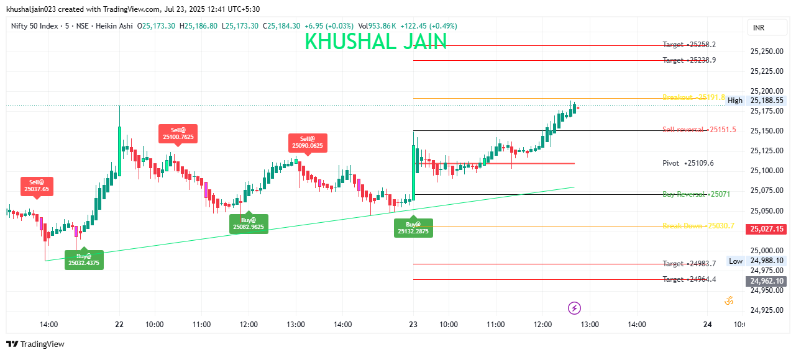
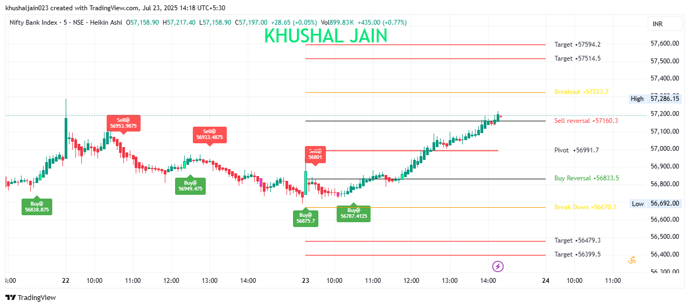
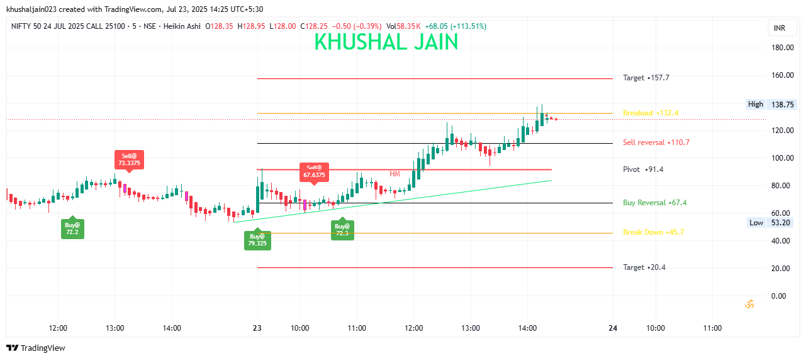

# Confluence-Based Indicator by Khushal Jain

A premium TradingView indicator built for serious traders. This all-in-one tool merges multiple high-probability confluence strategies into one visual script.

> 🚫 Not for beginners. This tool is designed for experienced traders who understand advanced market structure and price action.

---

## 📌 Key Features

- 🔹 Smart Money Concepts (SMC)
- 🔹 Support & Resistance (SR) Zones
- 🔹 Fibonacci Pivots (Daily, Weekly, Monthly)
- 🔹 VWAP (Intraday and Session)
- 🔹 Moving Averages (EMA 20, EMA 200)
- 🔹 BB Squeeze + Camarilla Pivots
- 🔹 Heikin Ashi and Candle Reversal Patterns
- 🔹 Volume-Based SR & Liquidity Zones
- 🔹 Breakout / Breakdown Confirmation
- 🔹 Scalping, Intraday, and Swing Trading Support

All bundled into a single customizable indicator that helps you identify powerful trading zones with multiple layers of confluence.

---

## 📈 Concept

This indicator helps traders visualize key levels and price behavior by combining price action, volume, and institutional-level concepts. It identifies **high-probability trade zones** using a combination of support/resistance, order blocks, Fibonacci levels, and dynamic indicators like VWAP or Bollinger Squeeze.

> Indicators don’t make money — the concept behind the indicator does.

---

## ✅ Strategy Overview

The strategy works best when used in trending markets (especially after a breakout or during a pullback). Use it in combination with your existing knowledge of:
- Smart Money Concepts
- Candle psychology
- Structure breakouts
- Trend continuation or reversal zones

---

## 📘 Trading Rules to Follow

1. **Identify Key Zones**  
   - Mark major support and resistance using SMC, pivot points, or trendlines.

2. **Look for Confirmation Candles**  
   - At **support**, expect a **green (bullish)** candle to confirm the bounce.  
   - At **resistance**, look for a **red (bearish)** candle to confirm rejection.

3. **Validate Breakouts / Breakdowns**  
   - A breakout is valid **only** if the candle **closes beyond** the zone.  
   - A false breakout touches a level but **closes inside** the zone — wait for confirmation.

4. **Retest for Entry**  
   - Enter on the **retest** of the breakout zone. If a small retest candle shows bullish/bearish intent, enter with smaller quantity and average near HL2 / Close / High to get better RR ratio.

5. **Manage Emotions**  
   - Stay calm. If a counter-candle appears during a confirmed breakout retest, let the setup complete. Don’t panic unless your SL is hit.

---

## 💡 Terms Explained

- **SMC (Smart Money Concepts):** A trading theory focused on how institutional players (smart money) manipulate price to trap retail traders. It includes concepts like order blocks, BOS (Break of Structure), liquidity hunts, etc.

- **HL2:** A candle price midpoint, calculated as  
  `HL2 = (High + Low) / 2`.  
  It often acts as a dynamic support/resistance and is used for scaling into positions or setting stop-loss levels.

---

## 🖼️ Screenshots

### Nifty50 Chart

### BankNifty Chart

### Nifty50 Options Chart

---

## 🧰 Tools & Technologies

- **Platform:** [TradingView](https://tradingview.com)
- **Chart Styles:** Heikin Ashi, Japanese Candles
- **Pivot Methods:** Fibonacci, Camarilla
- **Custom Script:** Pine Script
- **Optional Add-ons:**
  - Webhooks to brokers (Zerodha, Upstox)
  - Python + CCXT for automation

---

## 📬 Contact

- 🔗 [TradingView Profile](https://in.tradingview.com/khushaljain023/)
- 📩 Email: KhushalJain023@gmail.com
- 📸 Instagram: [@callmejainsahab_](https://instagram.com/callmejainsahab_)

---

## ⚠️ License

**MIT License**  
This is a paid, private indicator. Redistribution is strictly prohibited.

---

> 💡 *Trade smarter. Not harder.*
